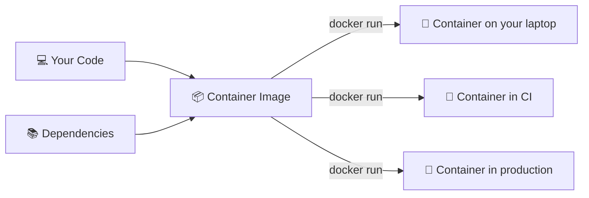

# Welcome to Docker! 🐳

Welcome to the **Docker Getting Started** lab! Docker is one of the most important tools in modern software development — once you learn containers, the way you build and ship software changes completely.

By the end of this lab, you will:

- ✅ Understand what containers are and why they matter
- ✅ Run pre-built containers from Docker Hub
- ✅ Explore a container's filesystem and logs
- ✅ Write a `Dockerfile` to package a Node.js app
- ✅ Build and run your own custom container image

## What is a Container?

A **container** is a lightweight, isolated environment that packages your application along with everything it needs to run: code, runtime, libraries, and configuration.

Think of it like a shipping container. The contents are standardized and self-contained — it doesn't matter whether it's on a cargo ship, a train, or a truck. A container image works the same way, running consistently on a developer laptop, a CI server, or a production cloud host.



Containers are different from virtual machines. A VM virtualizes an entire hardware stack and needs its own OS kernel. Containers share the host OS kernel and are far lighter — they start in milliseconds and use a fraction of the memory.

## ✅ Verify Your Environment

Run this command to confirm Docker is installed and working:

```bash
docker version
```

You should see version information for both the **Client** and the **Server** (the Docker daemon). If both sections appear, your environment is ready.

> [!NOTE]
> The "Server" section refers to the Docker daemon running in the background. It handles all container operations — building images, starting containers, managing networks and volumes.

## 👋 Your First Container

Run the classic Docker greeting:

```bash
docker run hello-world
```

When you run this command, Docker:

1. Looks for the `hello-world` image locally — doesn't find it
2. Automatically pulls it from **Docker Hub** (the public image registry)
3. Creates and starts a container from that image
4. The container prints its message and exits immediately

That's the full container lifecycle in one command: pull, create, run, exit.

> [!TIP]
> Notice the line "Unable to find image 'hello-world:latest' locally" followed by "Pulling from library/hello-world". Docker transparently fetched the image from Docker Hub — you didn't have to install anything manually.

In the next section, you'll run something that stays up: a real web server.
