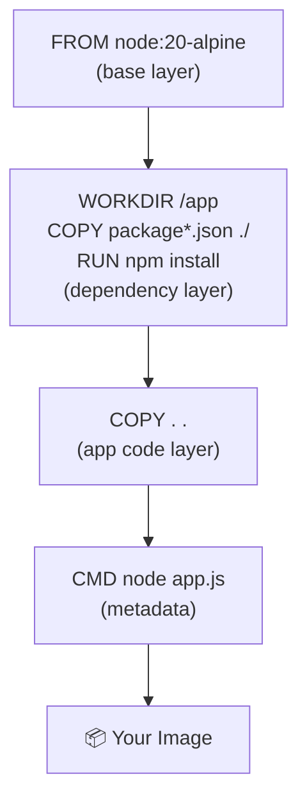

# Building Your First Image 🔨

Running pre-built images is useful, but Docker's real power is packaging **your own application** into an image. You do this with a `Dockerfile` — a plain text file with instructions that Docker follows to build the image, step by step.

## The Sample App

Your workspace includes a simple Node.js app. Open :fileLink[app.js]{path="app.js"} to read through it.

The app uses Express to serve a small web page that displays the container's hostname, platform, and Node.js version. It's already complete — your job is to containerize it.

Take a look at the dependencies in :fileLink[package.json]{path="package.json"} as well.

## How a Dockerfile Works

A `Dockerfile` is a recipe for building a container image. Docker reads each instruction from top to bottom, executing each one and committing the result as a new **layer**. Layers stack up to form the final image.

Here are the key instructions you'll use:

| Instruction | What it does |
|-------------|--------------|
| `FROM` | Start from an existing base image |
| `WORKDIR` | Set the working directory inside the image |
| `COPY` | Copy files from your build context into the image |
| `RUN` | Execute a shell command during the build |
| `EXPOSE` | Document which port the app listens on |
| `CMD` | The default command to run when the container starts |



## Write the Dockerfile

Save the following `Dockerfile` into the project directory. Click the **Save file** button on the code block:

```dockerfile save-as=Dockerfile
# Start from the official Node.js LTS image on Alpine Linux (small and fast)
FROM node:22-alpine

# Set the working directory inside the container
WORKDIR /app

# Copy package files first — this enables layer caching for npm install
COPY package*.json ./

# Install production dependencies
RUN npm install --production

# Copy the rest of the application source code
COPY . .

# Document the port the app listens on
EXPOSE 3000

# The command to run when the container starts
CMD ["node", "app.js"]
```

Open :fileLink[Dockerfile]{path="Dockerfile"} in the editor to confirm it was saved correctly.

> [!TIP]
> Notice that `COPY package*.json ./` comes **before** `COPY . .`. This is a deliberate optimization. Docker caches each layer — if your app code changes but `package.json` doesn't, Docker can reuse the cached `npm install` layer and skip reinstalling dependencies entirely. Put the things that change least often at the top.

## Build the Image

Now build your image. Make sure you're in the `project/` directory where your `Dockerfile` lives:

```bash
docker build -t getting-started .
```

Breaking it down:

- `docker build` — build a new image
- `-t getting-started` — **tag** (name) the image `getting-started`
- `.` — the **build context**: send the current directory's files to the Docker daemon as source material

Watch the output as Docker steps through each instruction. You'll see layer IDs being generated.

> [!NOTE]
> The first build downloads the `node:22-alpine` base image from Docker Hub. Subsequent builds reuse cached layers — try running the build command a second time to see just how fast caching makes it.

## Inspect Your New Image

After the build completes, list your images to confirm it exists:

```bash
docker images getting-started
```

You'll see the image name, tag (`latest` by default), image ID, when it was created, and its size.

> [!NOTE]
> Alpine Linux is a tiny Linux distribution (~5 MB). Using `node:22-alpine` instead of `node:22` keeps your image lean. Smaller images mean faster pulls, less storage, and a smaller attack surface.

Your image is built and ready to run. On to the next section!
